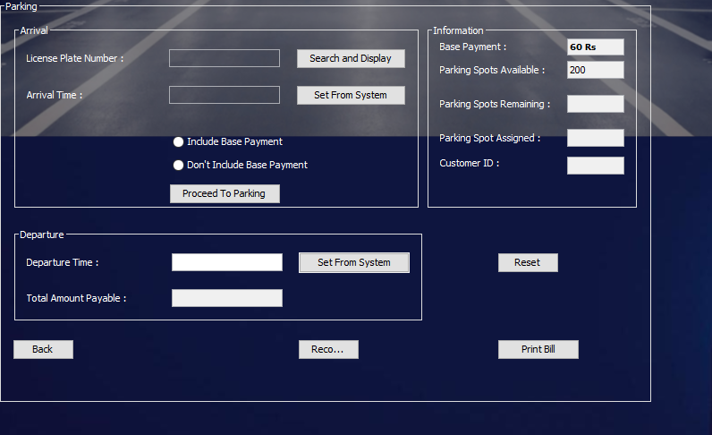

# Java-Parking-System
Java DBMS Project of Parking System Management

 
---
## Introduction
 

This is a Parking management system created in java.
It can Charge and assign parking spaces to vehicles entering the parking lot aswell as keep a record of each vehicle.

It is designed for the parking manager to be controlled by but administrator of the parking system can also control this in order to seek any flaw by the manager.
